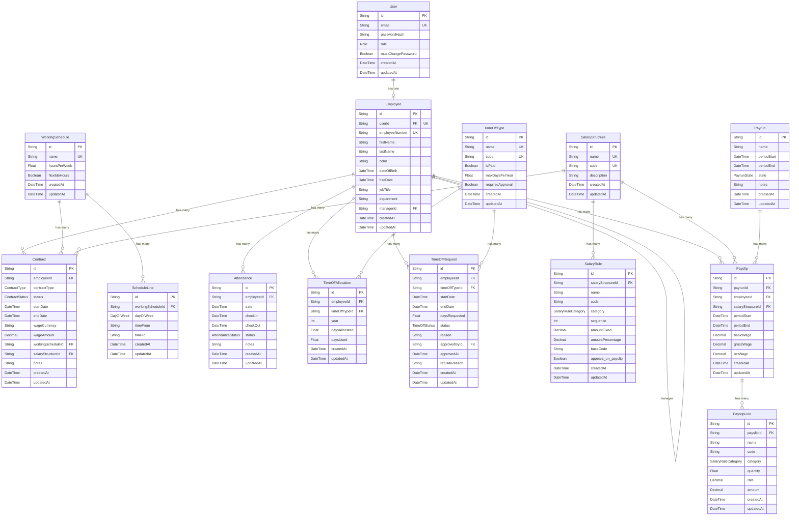

# TruPRM Database Entity Relationship Diagram

This diagram visually represents all the models in the current Prisma schema and how they relate to one another.

```mermaid
erDiagram
    %% Core Entities
    User {
        String id PK
        String email UK
        String passwordHash
        Role role
        Boolean mustChangePassword
        DateTime createdAt
        DateTime updatedAt
    }

    Employee {
        String id PK
        String userId FK "UK"
        String employeeNumber UK
        String firstName
        String lastName
        String color
        DateTime dateOfBirth
        DateTime hireDate
        String jobTitle
        String department
        String managerId FK
        DateTime createdAt
        DateTime updatedAt
    }

    %% Employment & Schedules
    Contract {
        String id PK
        String employeeId FK
        ContractType contractType
        ContractStatus status
        DateTime startDate
        DateTime endDate
        String wageCurrency
        Decimal wageAmount
        String workingScheduleId FK
        String salaryStructureId FK
        String notes
        DateTime createdAt
        DateTime updatedAt
    }

    WorkingSchedule {
        String id PK
        String name UK
        Float hoursPerWeek
        Boolean flexibleHours
        DateTime createdAt
        DateTime updatedAt
    }

    ScheduleLine {
        String id PK
        String workingScheduleId FK
        DayOfWeek dayOfWeek
        String timeFrom
        String timeTo
        DateTime createdAt
        DateTime updatedAt
    }

    %% Attendance & Time Off
    Attendance {
        String id PK
        String employeeId FK
        DateTime date
        DateTime checkIn
        DateTime checkOut
        AttendanceStatus status
        String notes
        DateTime createdAt
        DateTime updatedAt
    }

    TimeOffType {
        String id PK
        String name UK
        String code UK
        Boolean isPaid
        Float maxDaysPerYear
        Boolean requiresApproval
        DateTime createdAt
        DateTime updatedAt
    }

    TimeOffAllocation {
        String id PK
        String employeeId FK
        String timeOffTypeId FK
        Int year
        Float daysAllocated
        Float daysUsed
        DateTime createdAt
        DateTime updatedAt
    }

    TimeOffRequest {
        String id PK
        String employeeId FK
        String timeOffTypeId FK
        DateTime startDate
        DateTime endDate
        Float daysRequested
        TimeOffStatus status
        String reason
        String approvedById FK
        DateTime approvedAt
        String refusalReason
        DateTime createdAt
        DateTime updatedAt
    }

    %% Payroll
    SalaryStructure {
        String id PK
        String name UK
        String code UK
        String description
        DateTime createdAt
        DateTime updatedAt
    }

    SalaryRule {
        String id PK
        String salaryStructureId FK
        String name
        String code
        SalaryRuleCategory category
        Int sequence
        Decimal amountFixed
        Decimal amountPercentage
        String baseCode
        Boolean appears_on_payslip
        DateTime createdAt
        DateTime updatedAt
    }

    Payrun {
        String id PK
        String name
        DateTime periodStart
        DateTime periodEnd
        PayrunState state
        String notes
        DateTime createdAt
        DateTime updatedAt
    }

    Payslip {
        String id PK
        String payrunId FK
        String employeeId FK
        String salaryStructureId FK
        DateTime periodStart
        DateTime periodEnd
        Decimal basicWage
        Decimal grossWage
        Decimal netWage
        DateTime createdAt
        DateTime updatedAt
    }

    PayslipLine {
        String id PK
        String payslipId FK
        String name
        String code
        SalaryRuleCategory category
        Float quantity
        Decimal rate
        Decimal amount
        DateTime createdAt
        DateTime updatedAt
    }

    %% Relationships
    User ||--o| Employee : "has one"
    Employee ||--o| Employee : "manager"
    Employee ||--o{ Contract : "has many"
    Employee ||--o{ Attendance : "has many"
    Employee ||--o{ TimeOffAllocation : "has many"
    Employee ||--o{ TimeOffRequest : "has many"
    Employee ||--o{ Payslip : "has many"
    
    WorkingSchedule ||--o{ Contract : "has many"
    WorkingSchedule ||--o{ ScheduleLine : "has many"
    
    TimeOffType ||--o{ TimeOffAllocation : "has many"
    TimeOffType ||--o{ TimeOffRequest : "has many"
    
    SalaryStructure ||--o{ Contract : "has many"
    SalaryStructure ||--o{ SalaryRule : "has many"
    SalaryStructure ||--o{ Payslip : "has many"
    
    Payrun ||--o{ Payslip : "has many"
    Payslip ||--o{ PayslipLine : "has many"
```
